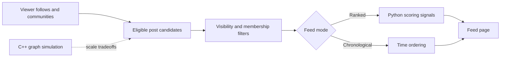

<div align="center">


[](apps/web/)
[](apps/web/)
[](services/ranking-python/)
[](services/feed-sim-cpp/)

**A social platform engineering lab for ranked feeds, creator communities, and the systems that make them scale.**

</div>

---

## Overview

**Orbit** is a full-stack social platform that models the product and backend concerns behind feed-driven applications like Instagram, Facebook, X, and YouTube. It combines an interactive Next.js experience with a separately testable Python ranking prototype and a C++ simulator for feed-scale tradeoffs.

The project is built around a simple idea: the interesting part of a social app is not only the interface. It is the social graph, eligibility rules, ranking signals, cache behavior, asynchronous work, and the decisions that keep a feed responsive as the graph gets large.

## What It Includes

<table>
  <tr>
    <td width="50%">
      <h3>Personalized Feed</h3>
      <p>Switch between chronological delivery and explainable ranked discovery, using recency, affinity, community context, and engagement signals.</p>
    </td>
    <td width="50%">
      <h3>Social Product Surface</h3>
      <p>Browse creator profiles and communities, create posts, join conversations, react, save, and follow notification activity.</p>
    </td>
  </tr>
  <tr>
    <td width="50%">
      <h3>Ranking Sandbox</h3>
      <p>Keep ranking logic in Python so scoring ideas can be tested and tuned independently from the product experience.</p>
    </td>
    <td width="50%">
      <h3>Feed Systems Simulator</h3>
      <p>Use C++ to explore graph fanout, cache pressure, latency, and the tradeoffs of fanout-on-read versus fanout-on-write.</p>
    </td>
  </tr>
</table>

## How It Works



The MVP uses **fanout-on-read**: load the viewer's graph, find posts they can see, then score or order them at request time. The intended scale path is hybrid fanout: materialize economical feed windows, keep large-creator feeds read-time, cache active pages, and move notifications, trending, media processing, and ranking refreshes into background work.

## Tech Stack

| Layer | Tooling | Role |
| --- | --- | --- |
| Product application | Next.js 16, React 19, TypeScript | Social UI and product workflows |
| Ranking prototype | Python | Experiment-friendly, testable feed scoring |
| Systems simulation | C++ and CMake | Fanout and performance tradeoff exploration |
| Planned data layer | PostgreSQL, Prisma, Auth.js | Identity, relationships, visibility, durable writes |
| Planned infrastructure | Redis-compatible cache and background jobs | Feed windows, notifications, trending, async work |

## Quick Start

Requirements: Node.js, npm, and Python. A C++ compiler is only necessary for the simulator.

```bash
npm install
npm run dev
```

Open the app at:

```text
http://localhost:3000
```

Run the available checks:

```bash
npm run lint
npm run build
npm run test:python
```

Build the C++ simulator:

```bash
npm run build:cpp
```

## Project Structure

```text
Orbit/
  apps/
    web/                       Next.js application
  services/
    ranking-python/            Ranking prototype and unit tests
    feed-sim-cpp/              C++ feed-scale simulation
  docs/
    architecture.md            Data model and feed design
    scaling.md                 Scaling notes and tradeoffs
```

## Engineering Focus

- **Social graph:** users, follows, communities, and membership.
- **Content graph:** posts, comments, reactions, saves, and visibility controls.
- **Ranking:** explainable signals first, so experiments are measurable before more complex models are introduced.
- **Reliability:** cache boundaries, idempotent writes, and background jobs are part of the design from the beginning.
- **Scale:** deliberate tradeoffs between write amplification, read latency, cache efficiency, and creator size.

For the deeper design discussion, read the [architecture notes](docs/architecture.md) and [scaling notes](docs/scaling.md).

<div align="center">


</div>
